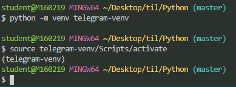
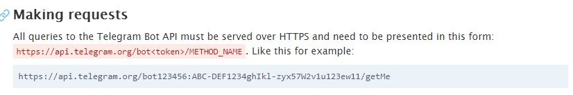

# 가상환경 만들기



pip list  > 설치된 라이브러리 확인

다른 bash 창에서 (가상환경이 아닌) pip freeze > 설치된 모듈 확인 > 복사

requirements.txt 파일 만들어서 붙여넣기

pip install -r requirements.txt

다른 방법? ) 가상환경 폴더에 requirements.txt 파일 만들어서  pip freeze > requirements.txt 하면 굳이 복붙 안해도 txt 파일에 내용 자동으로 들어간다.

- 가상환경에 모듈들 한꺼번에 설치
- 가상환경 폴더 삭제하면 가상환경 삭제 가능

> 개발 환경마다 모듈이 다르고, 모듈들의 버전도 다르기에 이것들이 개발환경마다 영향을 미칠 수 있어서 가상환경을 구현한다.?


gitignore > telegram-venv/ 내용을 통해 가상환경 깃에 안 올라감

Telegram 폴더에 app.py 만들고,

pip install pylin

https://api.telegram.org/bot<token>/METHOD_NAME

token 자리에 내 private 암호? 입력


pip install python-decouple


touch .env  > token 을 저장할 파일 생성

.evn 파일 : 뛰어쓰기 금지


# 로컬서버와 텔레그렘 연결

## ngrok 이용

[ngrok](https://ngrok.com/download)

: 텔레그렘이 로컬서버에 들어가는 것을 도와주는 것

cmd 창에서 ngrok http 5000 으로 실행

```
ngrok http 5000
>>Forwarding                    http://923506ba.ngrok.io -> http://localhost:5000  
```

실행하면 나오는 forwarding 주소 io 까지 복사

url 이 매번 바뀌므로 ngrok 종료 시키지 말기 최대한

/setWebhook?url=<ngrok forwarding url https>

ngrok forwarding url https -> 서버에서 돌리고 있는 주소
/setWebhook?url=https://923506ba.ngrok.io


# Flask 서버에 올리기

## pythonanywhere 사용

https://www.pythonanywhere.com/user/Mishuni15/

2) pythonanywhere로 서버에 올려서 연결하는 방법 

pythonanywher 실행 주소
http://mishuni15.pythonanywhere.com/

/setWebhook?url=https://mishuni15.pythonanywhere.com/<token>